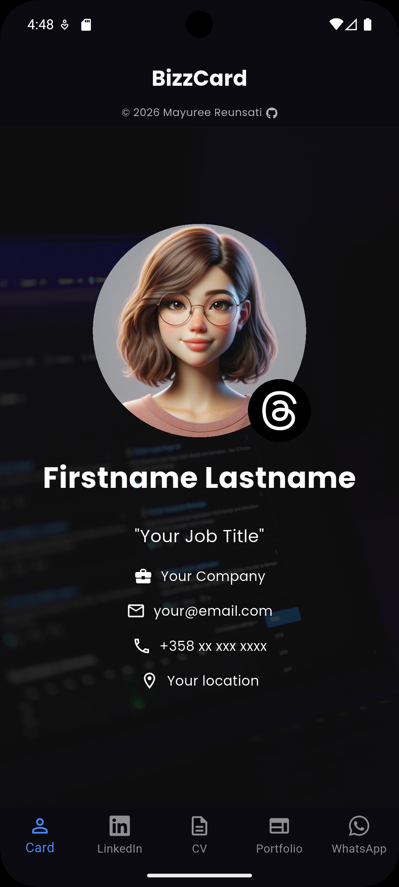

# BizzCard 📱

 BizzCard is a simple and elegant digital business card app built with Flutter. It presents personal details, contact information, and professional links in a clean mobile-friendly interface.



## Overview

BizzCard is designed as a modern alternative to a traditional paper business card. It helps present a personal profile in a more interactive and professional way.

The app includes a profile home screen, public sharing pages, and a privacy-friendly CV page with a secure send feature.

## Features

- Clean and professional dark theme
- Preloaded background and profile images for smoother loading
- Centered and scrollable layout for better responsiveness
- Profile image with logo overlay
- Reusable pages for QR code and link sharing
- LinkedIn, Portfolio, and WhatsApp pages
- Private CV page with secure PDF sharing via Gmail or WhatsApp
- File picker to select CV directly from device storage
- Custom app bar with creator credit and GitHub link

## Screens

- **Home** — profile, role, and contact details
- **LinkedIn** — QR code and profile access
- **Portfolio** — QR code and portfolio access
- **WhatsApp** — QR code for quick contact
- **My CV** — send CV privately as a PDF attachment via any app

## Tech Stack

- [Flutter](https://flutter.dev/)
- Dart
- [google_fonts](https://pub.dev/packages/google_fonts)
- [font_awesome_flutter](https://pub.dev/packages/font_awesome_flutter)
- [url_launcher](https://pub.dev/packages/url_launcher)
- [share_plus](https://pub.dev/packages/share_plus)
- [file_picker](https://pub.dev/packages/file_picker)

## Getting Started

### Prerequisites

Before running the project, make sure you have:

- [Flutter SDK](https://docs.flutter.dev/install) installed
- Android Studio, VS Code, or another Flutter-supported editor
- An emulator, browser, or physical device for testing

### Installation

1. Clone the repository:

```bash
git clone https://github.com/mareerray/bizzcard.git
```

2. Go to the project folder:

```bash
cd bizzcard
```

3. Install dependencies:

```bash
flutter pub get
```

## Running the App

### Run on a connected device or emulator

```bash
flutter run
```

### Run on Chrome

```bash
flutter run -d chrome
```

## Build APK

To generate a release APK for Android:

```bash
flutter build apk --release
```

The generated APK will be located at:

```text
build/app/outputs/flutter-apk/app-release.apk
```

## Install on Android Phone

1. Build the APK.
2. Transfer `app-release.apk` to your Android phone.
3. Open the file on your phone and install it.
4. If needed, allow installation from unknown sources in your Android settings.

## Project Structure

```text
lib/
├── main.dart
├── screens/
│   ├── main_screen.dart
│   ├── bizz_card_screen.dart
│   ├── edit_profile_screen.dart
│   └── qr_page.dart
├── data/
│   └── qr_items.dart
├── service/
│   └── profile_service.dart
assets/
└── images/
    ├── bgimg.jpg
    ├── Screenshot.png
    ├── logo_image.png
    ├── profile_image.jpg
    └── qr_image.png
```

## Sending CV

The CV page allows you to privately share your CV as a PDF attachment:

1. Tap the **Send CV** button on the My CV page
2. Select your CV PDF from your device storage
3. Choose Gmail, WhatsApp, or any other app to send it

> The CV file is never stored inside the app — it is picked directly from your device each time, keeping your personal document private and secure.

## What I Learned

This project helped me practice and improve:

- Flutter widget structure
- Layout design and responsiveness
- Working with images and assets
- Navigation with multiple screens
- Sharing links and QR-based content
- Improving UI details and readability
- Thinking about privacy in app design
- Integrating file picker and native sharing features

## Author

**Mayuree Reunsati**  
GitHub: [mareerray](https://github.com/mareerray)

## License

This project is for personal learning and portfolio purposes.
