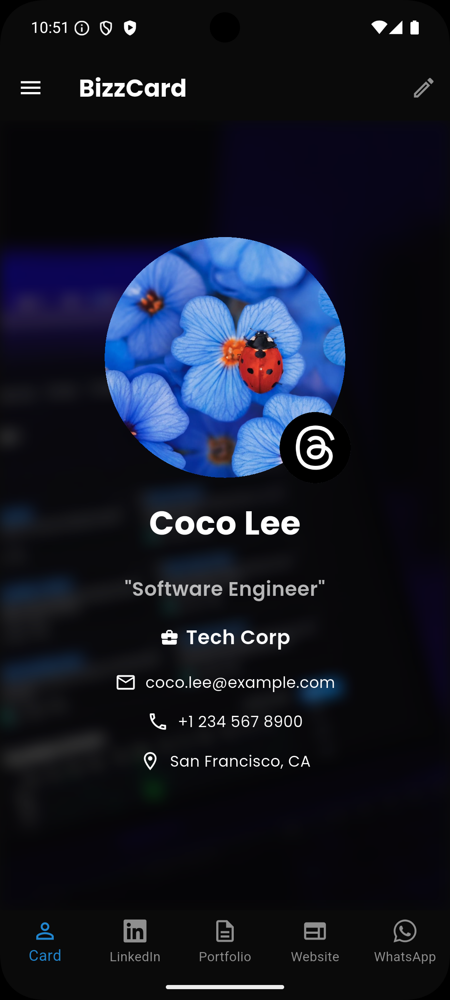

# BizzCard 📱💻

 BizzCard is a digital business card and Progressive Web App (PWA) built with Flutter. It presents profile information, contact details, professional links, skills, and private CV-sharing features in a clean, responsive interface.

<br clear="left"/>

🌐 **Live app:** [Open BizzCard](https://bizzcard-app.vercel.app)



## Overview

BizzCard is a modern alternative to a traditional paper business card. It runs on Android devices and supported web browsers, and can be installed as a PWA for an app-like experience.

Profile information, selected images, skills, and custom background settings are stored locally on the device or browser.

## Features

- Editable profile with contact details and professional links.
- Profile image with logo overlay.
- Custom background image selection and reset.
- Skills grouped by category.
- LinkedIn, Portfolio, Website, and WhatsApp pages.
- QR codes for sharing profile links.
- Private CV sharing as a PDF attachment.
- Local profile and preference storage.
- Responsive layouts for mobile and web.
- Installable Progressive Web App.
- Android APK support.
- Live web version hosted on Vercel.

## Screens

- **Home** — profile, role, company, skills, and contact details.
- **LinkedIn** — LinkedIn profile access and QR code.
- **Portfolio** — portfolio access and QR code.
- **Website** — website access and QR code.
- **WhatsApp** — quick contact through WhatsApp.
- **My CV** — privately share a CV as a PDF.
- **Edit Profile** — update profile information, images, links, and skills.
- **Settings** — select or reset the custom background.

## Install the PWA

Open the [BizzCard web app](https://bizzcard-app.vercel.app) in a supported browser.

- **Android/Desktop:** Open the browser menu and select **Install app** or **Add to home screen**.
- **iPhone/iPad:** Open the site in Safari, tap **Share**, then select **Add to Home Screen**.

The installation option depends on the browser and device.

## Tech Stack

- [Flutter](https://flutter.dev/)
- Dart
- Flutter Web and PWA
- [google_fonts](https://pub.dev/packages/google_fonts)
- [font_awesome_flutter](https://pub.dev/packages/font_awesome_flutter)
- [url_launcher](https://pub.dev/packages/url_launcher)
- [share_plus](https://pub.dev/packages/share_plus)
- [file_picker](https://pub.dev/packages/file_picker)
- [image_picker](https://pub.dev/packages/image_picker)
- [shared_preferences](https://pub.dev/packages/shared_preferences)

## Getting Started

### Prerequisites

- [Flutter SDK](https://docs.flutter.dev/install)
- Android Studio, VS Code, or another Flutter-supported editor
- An emulator, browser, or physical device

### Install Dependencies

```bash
git clone https://github.com/mareerray/bizzcard-app.git
cd bizzcard
flutter pub get
```

### Run the App

Run on a connected device or emulator:

```bash
flutter run
```

Run the web version in Chrome:

```bash
flutter run -d chrome
```

## Build

Build the Android APK:

```bash
flutter build apk --release
```

Build the PWA:

```bash
flutter build web --release
```

The web build is generated in:

```text
build/web/
```

This directory can be deployed to Vercel or another static hosting provider.

## Project Structure

```text
lib/
├── main.dart
├── app_gate.dart
├── config.dart
├── constants.dart
├── route_observer.dart
├── screens/
├── data/
├── models/
├── services/
└── widgets/

assets/
├── icon/
└── images/
```

## Sending a CV

1. Open the **Portfolio** page.
2. Tap **Send CV**.
3. Select a PDF from device storage.
4. Choose Gmail, WhatsApp, or another compatible app.

The CV is selected directly from the device and is not stored inside the app.

## Author

**Mayuree Reunsati**  
GitHub: [mareerray](https://github.com/mareerray)

## License

This project is for personal learning and portfolio purposes.